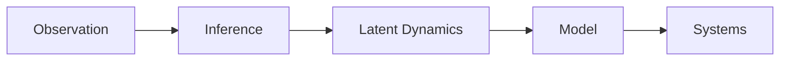

<div align="center">

# InSearchOfMagnumOpus


<br>

<a href="https://iinsearchofmagnumopus.github.io">
    
</a>

<a href="https://medium.com/@InSearchOfMagnumOpus">
    
</a>

<a href="https://linkedin.com/in/dutt-r">
    
</a>

<a href="https://github.com/IInSearchOfMagnumOpus">
    
</a>

<a href="https://github.com/IInSearchOfMagnumOpus">
    
</a>

---

*"The interesting part of a system is usually the part you cannot observe easily."*

</div>

---

<p align="center">

</p>

# About
I'm interested in building **models** that explain software.

Across rendering engines, distributed systems, networking, and complex systems, one question keeps reappearing:

> **Can two systems exhibit identical observable behaviour while possessing fundamentally different internal dynamics?**

That question drives nearly everything here.

---
<p>
    
    
</p>


# Research Areas

```text
                           Mathematics
                                │
      ┌─────────────────────────┼─────────────────────────┐
      │                         │                         │
      ▼                         ▼                         ▼
 Graph Theory          Dynamical Systems       Information Theory
      │                         │                         │
      └─────────────────────────┼─────────────────────────┘
                                │
                                ▼
                    Systems Programming
                                │
                                ▼
                     Real Implementations
```

---

# Current Focus

<table>
<tr>

<td width="50%">

### Systems

- Rust
- Memory Models
- Typestate
- Networking
- Compiler Design
- Zero-Cost Abstractions

</td>

<td width="50%">

### Graphics

- Vulkan
- GPU Scheduling
- Frame Graphs
- Resource Lifetime
- Rendering Architecture
- Explicit Synchronization

</td>

</tr>
</table>

---

# Current Research

```rust
struct System {
    observable_state,
    latent_state,
    transition_function,
}
```


# Selected Projects

| Project | Description |
|---------|-------------|
| **gLexShrD** | Experimental graphics engine treating GPU work as a schedulable dependency graph. |
| **Recovery Dynamics** | Computational framework for studying latent resilience in complex systems. |
| **epoll_server** | High-performance event-driven TCP server built in Rust using Linux `epoll`, exploring scalable I/O multiplexing and low-level systems programming. |
| **Networking Experiments** | Typestate-oriented protocol implementations and networking infrastructure. |

---

# Toolbox

<div align="center">


</div>

---

# GitHub Analytics

<p align="center">
</p>

<p align="center">


---

<h1 align="left">Philosophy</h2>

<div align="center">



</div>

---

<div align="center">


**Website**:
https://iinsearchofmagnumopus.github.io

**Medium**:
https://medium.com/@InSearchOfMagnumOpus

**LinkedIn**:
https://linkedin.com/in/dutt-r

</div>
